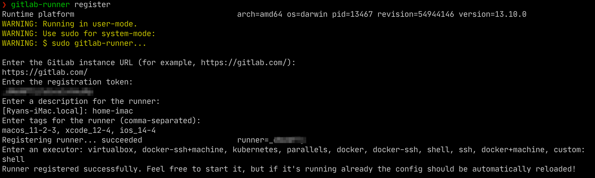

# Add a mac as a GitLab runner

## Overview

A guide for registering a specific runner for gitlab.com

1. Install GitLab Runner on macOS
2. Register GitLab Runner

## Get Started

### **1. Install GitLab Runner on macOS**

```bash
brew install gitlab-runner
```

### 2. Register GitLab Runner

 1. Register GitLab Runner as a service

```bash
brew services start gitlab-runner
```

 2. Go to gitlab.com -&gt; project settings -&gt; CI/CD and expand the **Runners** section


 3. Register the runner 

```text
gitlab-runner register
```



You will see the runner is registered successfully in the Runners section on gitlab.com:


## References

* [Install GitLab Runner on macOS \| GitLab Documentation](https://gitlab.com/gitlab-org/gitlab-runner/blob/master/docs/install/osx.md)
* [Configuring runners in GitLab \| GitLab Documentation](https://docs.gitlab.com/ee/ci/runners/README.html#specific-runners)
* [Registering the runners \| GitLab Documentation](https://docs.gitlab.com/runner/register/#macos)


