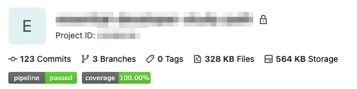
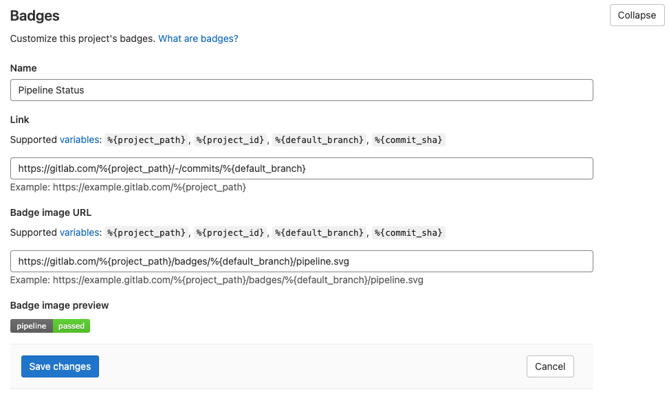

# Setup CI pipeline for iOS projects on gitlab.com

## Overview

1. Setup CI pipeline with .gitlab-ci.yml
2. Adding badges for pipeline status and code coverage

## Prerequisite

* A macOS machine with Xcode and Xcode command line tools installed 
* [The above macOS machine is registered as a GitLab runner](add-a-mac-as-a-gitlab-runner.md)
* An iOS app with a testing scheme with test cases
* Tools
  * [bundler](https://bundler.io/)
  * jq \(optional, for processing the code coverage report\)
    * `brew install jq` 
  * xcpretty
    * create `Gemfile` in the same folder as the Xcode project
    * with the content: 

      ```text
      source "https://rubygems.org"
      gem "xcpretty"
      ```

## Key Terms of GitLab CI/CD

`Pipelines` are the top-level component of continuous integration, delivery, and deployment.

`Jobs` defines what to do, executed by runners

`Stages` defines when to run the jobs

## **Setup CI pipeline with .gitlab-ci.yml**

```yaml
stages:
  - prebuild
  - build

cache:
  key: ${CI_COMMIT_REF_SLUG}
  paths:
    - my-project-path/.bundle
    - my-project-path/vendor

install_dependencies:
  stage: prebuild
  script:
    - unset cd
    - cd my-project-path
    - bundle config set --local deployment 'true'
    - bundle install
  tags:
    - macos_11-2-3
    - xcode_12-4
    - ios_14-4

build_project:
  stage: build
  script:
    - unset cd
    - cd my-project-path
    - xcodebuild clean build test -project my-project.xcodeproj -scheme "CI" CODE_SIGN_IDENTITY="" CODE_SIGNING_REQUIRED=NO | bundle exec xcpretty -s
    - xcrun xccov view --report --json DerivedData/my-project-path/Logs/Test/*.xcresult > xcresult.json
    - cat xcresult.json | jq ".lineCoverage" -j | awk '{printf "XCTEST_COVERAGE=%0.2f%%\n",$1*100}'
  tags:
    - macos_11-2-3
    - xcode_12-4
    - ios_14-4

```

### Structure of the configuration file:

line 1-3: defined a pipeline with 2 stages, `prebuild` and `build`

line 5-9: defined the paths that will be cached between the jobs

line 11-21: defined the `install_dependencies` Job

line 23-34: defined the `build_project` Job

line 28: build and test the Xcode project

line 29-30: gather the code coverage stat   

### Cache the dependencies between Jobs

* `my-project-path/.bundle` is storing the bundle config
* `my-project-path/.vendor` is storing the installed gems
* `${CI_COMMIT_REF_SLUG}` is the branch or tag name for which project is built

Without cache, the gems installed in the `prebuild` stage will be deleted when the `build` stage is executed, even the Jobs are executed on the same machine

The example will share the caches across the same branch

### The use of `unset cd`

when `rvm` is used, it will redefine the `cd` command as below:

```text
cd () 
{ 
    __zsh_like_cd cd "$@"
}
```

* When the `cd` command is used in the Job, it will throw `ERROR: Build failed with: exit status 1` and exit immediately
* `unset cd` is used to reset `cd` to be the shell builtin command
  * it can be added before the step that used the `cd` command \(as in the example\)
  * or can be added in `.bash_profile` 

### Other points to note

* the `tags` must match the configs in the **Runners** section in gitlab.com -&gt; project settings -&gt; CI/CD
* the file `.gitlab-ci.yml` should be placed in the root of the git repo
* the DerivedData path is set relative to the Xcode project

## Adding badges for pipeline status and code coverage

### Pipeline Status Badge



To configure the pipeline status:

* gitlab.com -&gt; project settings -&gt; General -&gt; Expand the Badges Section
* Add Badges with following settings:
  * Name: `Pipeline Status`
  * Link: `https://gitlab.com/%{project_path}/-/commits/%{default_branch}`
  * Badge image URL: `https://gitlab.com/%{project_path}/badges/%{default_branch}/pipeline.svg`



### Code Coverage Badge

 1. Get the code coverage report in JSON format after the project is built  
`xcrun xccov view --report --json DerivedData/my-project/Logs/Test/*.xcresult > xcresult.json`

 2. Print the code coverage to the job log  
`cat xcresult.json | jq ".lineCoverage" -j | awk '{printf "XCTEST_COVERAGE=%0.2f%%\n",$1*100}'` 

the above line is to 

* get the `lineCoverage`field from the JSON
* multiply the value by 100
* convert the value in percentage
* print the value with 2 decimal places

noted that the percentage sign `%` must be included for **Test coverage parsing**

 3. Set the **Test coverage parsing** regular expression to grep the result in step 2.

* gitlab.com -&gt; project settings -&gt; CI/CD -&gt; Expand the General pipelines Section
* In **Test coverage parsing**, fill in `XCTEST_COVERAGE=(\d+.\d+%)` 

 4. Add the badge like pipeline status 

* gitlab.com -&gt; project settings -&gt; General -&gt; Expand the Badges Section
* Add Badges with following settings:
  * Name: `Code Coverage`
  * Link: `https://gitlab.com/%{project_path}/-/commits/%{default_branch}`
  * Badge image URL: `https://gitlab.com/%{project_path}/badges/%{default_branch}/pipeline.svg`

## References

### Concepts

* [https://docs.gitlab.com/ee/ci/pipelines/](https://docs.gitlab.com/ee/ci/pipelines/)

### Configurations

* [https://docs.gitlab.com/ee/ci/variables/predefined\_variables.html](https://docs.gitlab.com/ee/ci/variables/predefined_variables.html)
* [https://stackoverflow.com/questions/41497356/code-coverage-for-swift-3-0-project-in-gitlab-ci](https://stackoverflow.com/questions/41497356/code-coverage-for-swift-3-0-project-in-gitlab-ci)

### Caching dependencies between jobs

* [https://docs.gitlab.com/ee/ci/caching/](https://docs.gitlab.com/ee/ci/caching/)

### Badges

* [https://docs.gitlab.com/ee/user/project/badges.html](https://docs.gitlab.com/ee/user/project/badges.html)
* [https://docs.gitlab.com/ee/ci/pipelines/settings.html\#test-coverage-parsing](https://docs.gitlab.com/ee/ci/pipelines/settings.html#test-coverage-parsing)
* [https://docs.gitlab.com/ee/ci/pipelines/settings.html\#test-coverage-report-badge](https://docs.gitlab.com/ee/ci/pipelines/settings.html#test-coverage-report-badge)
* [https://unix.stackexchange.com/questions/113515/how-to-modify-output-in-bash-command-pipeline](https://unix.stackexchange.com/questions/113515/how-to-modify-output-in-bash-command-pipeline)
* [https://unix.stackexchange.com/questions/131013/formatting-numbers-using-awk-print](https://unix.stackexchange.com/questions/131013/formatting-numbers-using-awk-print)
* [https://stackoverflow.com/questions/3272215/bash-how-to-perform-arithmetic-on-numbers-in-a-pipe](https://stackoverflow.com/questions/3272215/bash-how-to-perform-arithmetic-on-numbers-in-a-pipe)

### Troubleshoot

* ERROR: Build failed with: exit status 1
  * [https://gitlab.com/gitlab-org/gitlab-runner/-/issues/114](https://gitlab.com/gitlab-org/gitlab-runner/-/issues/114)
  * [https://juejin.cn/post/6844903553970995207](https://juejin.cn/post/6844903553970995207)
  * [https://stackoverflow.com/questions/49444879/gitlab-ci-runner-job-failed-exit-status-1-when-changing-directory/54471745\#54471745](https://stackoverflow.com/questions/49444879/gitlab-ci-runner-job-failed-exit-status-1-when-changing-directory/54471745#54471745)

