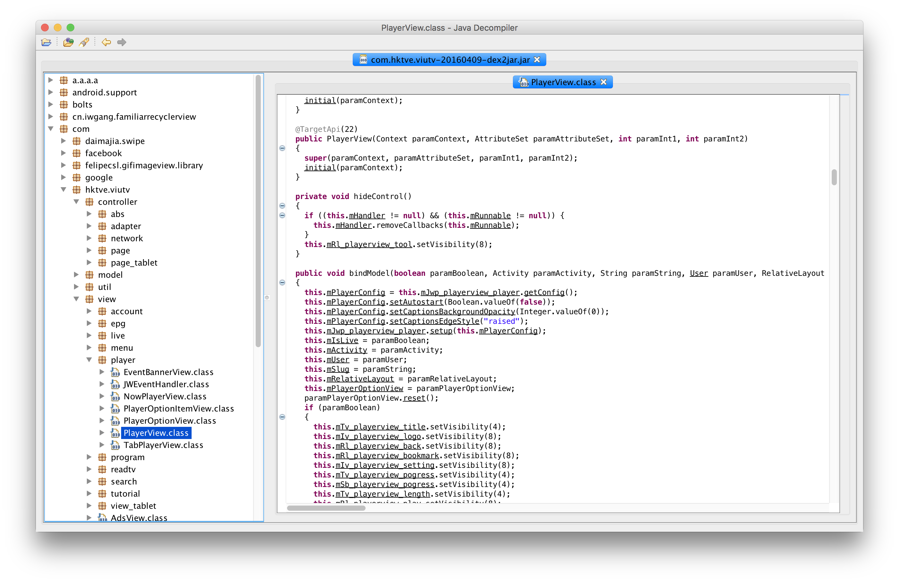

# Decompile Android apk

## Example apk

- [Viu TV app for Android](https://drive.google.com/file/d/0B5SRiNhfsNj2YkJtWjJPcjVjWTA/view)

## Overview

1. Convert `*.dex` to `*.jar` using [dex2jar](http://code.google.com/p/dex2jar/)
2. using [JD-GUI](http://jd.benow.ca/) to view the source code

## Using dex2jar

1. Download `dex2jar` from https://bitbucket.org/pxb1988/dex2jar/downloads
2. Unzip `dex2jar-2.0.zip` to `~/bin/dex2jar-2.0/` or other directory
3. Make the script executable

```
$ cd ~/bin/dex2jar-2.0/
$ chmod +x *.sh
```

4. Convert the apk into jar file using the convert script

```
$ sh ~/bin/dex2jar-2.0/d2j-dex2jar.sh com.hktve.viutv-20160409.apk
```

5. A jar file is then created

## Open the jar file using JD-GUI

Result:



## References

- [decompiling DEX into Java sourcecode | StackOverflow](http://stackoverflow.com/a/4177581/3869284)
