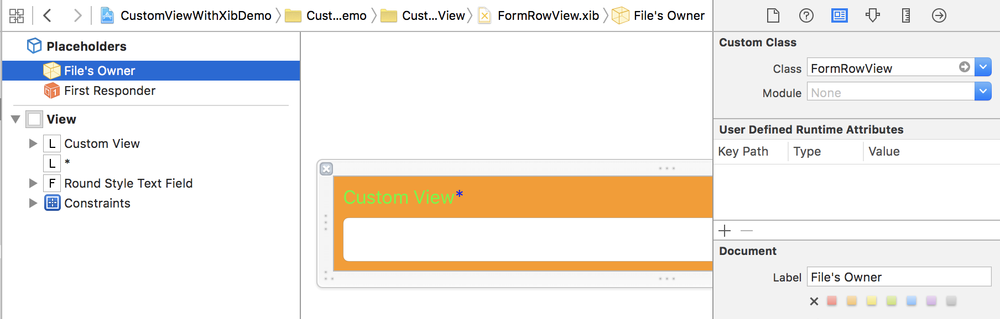
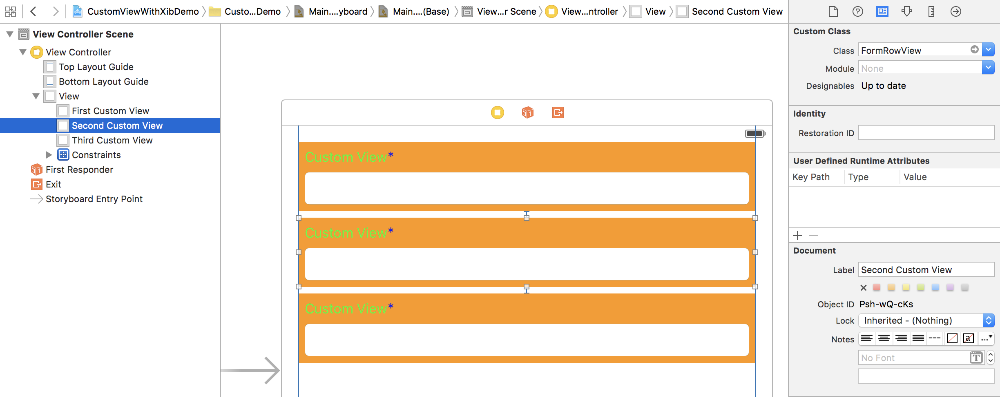
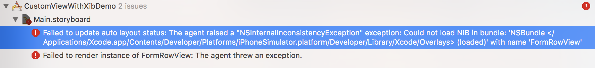

# Custom View using xib

Let `xxx` be the name of our new Custom View.

### Create Custom View

1. Create `xxx.xib`
2. Create the custom class xxx (`xxx.h`, `xxx.m`), which is a subclass of `UIView`
3. in xib, set `Custom Class` of `File's Owner` to `xxx`
4. Override `initWithCoder`:

```
- (instancetype)initWithCoder:(NSCoder *)aDecoder
{
    if (self = [super initWithCoder:aDecoder]) {
        UIView *view = [[[NSBundle bundleForClass:[self class]]loadNibNamed:NSStringFromClass([self class]) owner:self options:nil] firstObject];
        view.frame = self.bounds;
        [self addSubview:view];
    }
    return self;
}
```

### Try it!

1. Drag an empty UIView to a UIViewController, and set the custom class of the UIView to `xxx`
2. Set the constraints of the UIView
3. Run the project, you should be able to see our Custom View

### Preview Custom View in Interface Builder (IBDesignable)

Now you may already noticed that you are not able to preview the Custom View in our UIViewController.
To fix this we need to make the Custom View `IBDesignable`

#### 1. add `IB_DESIGNABLE` marco in `xxx.h`

```
#import <UIKit/UIKit.h>

IB_DESIGNABLE

@interface FormRowView : UIView

@end
```

#### 2. implement `prepareForInterfaceBuilder` and load the Custom View from xib like `initWithCoder:`

```
- (void)prepareForInterfaceBuilder
{
    UIView *view = [[[NSBundle bundleForClass:[self class]]loadNibNamed:NSStringFromClass([self class]) owner:self options:nil] firstObject];
    view.frame = self.bounds;
    [self addSubview:view];
}
```

### Output

Custom View:



Usage (in UIViewController):



---

## Points to note

#### 1. `[NSBundle bundleForClass:]` vs `[NSBundle mainBundle]`

The following error will occur when using `[NSBundle mainBundle]`:



#### 2. Other init methods

You may also override other init methods like `init`, `initWithFrame:` if you create the custom view in code.

#### 3. Don't set the Custom Class of the root UIView of the Custom View

All you need to set is only the `File's Owner` of the xib.

#### 4. What's going on?

Let `A` be the name of the empty UIView in our UIViewController
Let `B` be the UIView that we load from xib
Let `C` be the custom view class

- `A` is our starting point to load an instance of our custom view class `C`, but it is an empty UIView which shows nothing on screen. `initWithCoder` is called when `A` is loaded.
- `B` is the view that we want to show on screen.
- We set the `File's Owner` of `B` to `C`, so `C` have the full control of all elements of `B`(set outlet or action).
- `B` is a subview of `A`


ref:

- http://stackoverflow.com/questions/9251202/how-do-i-create-a-custom-ios-view-class-and-instantiate-multiple-copies-of-it-i
- http://www.maytro.com/2014/04/27/building-reusable-views-with-interface-builder-and-auto-layout.html
- http://stackoverflow.com/a/26202160/3869284
- http://stackoverflow.com/a/35397975/3869284
