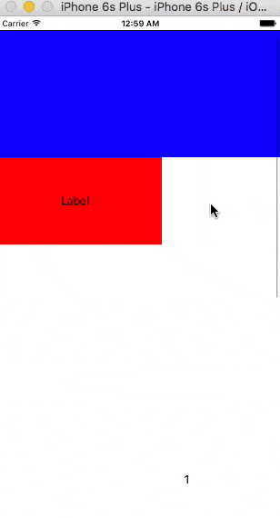

# Keep subview in Scroll View always on screen

## Demo:



* contentOffset is 0 if the scrollView is scrolled top
* contentOffset of a scrollView will increase as user scroll down

To keep the overlayView on the same position on screen, just increase the posY of the frame of the overlayView as the contentOffset increase

```text
@interface ViewController ()<UIScrollViewDelegate>

@property (weak, nonatomic) IBOutlet UIScrollView *scrollView;
@property (strong, nonatomic) IBOutlet UIView *overlayView;

@property (assign, nonatomic) float initialOverlayY;

@end
```

```text
@implementation ViewController

- (void)viewDidLoad {
    [super viewDidLoad];

    [self.scrollView addSubview:self.overlayView];
    self.initialOverlayY = self.overlayView.frame.origin.y;
    self.scrollView.delegate = self;
}

- (void)scrollViewDidScroll:(UIScrollView *)scrollView
{
    CGRect frame = self.overlayView.frame;
    float minHeight = 40; // configurable
    if (scrollView.contentOffset.y + minHeight <= self.initialOverlayY) {
        // keep the posY, so the overlayView move with the scrollView
        frame.origin.y = self.initialOverlayY;
    } else {
        // keep the overlayView on the same position of screen
        frame.origin.y = scrollView.contentOffset.y + minHeight;
    }
    self.overlayView.frame = frame;
}
@end
```

